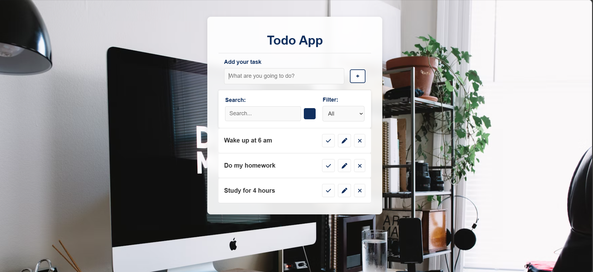

# iJunior-Trainee-ToDoList-DOM

# Todo App Project

## Overview

This project was created to practice JavaScript, DOM manipulation, and using Local Storage for saving and retrieving data. It allows users to add, edit, remove, and mark tasks as completed in a todo list.

## Key Features

- **Add tasks**: Users can add new tasks to the todo list.
- **Edit tasks**: Users can edit existing tasks.
- **Remove tasks**: Users can delete tasks from the list.
- **Mark tasks as completed**: Tasks can be marked as done, changing their appearance.
- **Persist tasks**: Tasks are stored in Local Storage, allowing them to persist even after the browser is closed or refreshed.

## Technologies Used

- **HTML**: Structuring the page and defining the form elements.
- **CSS**: Styling the page.
- **JavaScript**: Used for DOM manipulation and handling events (such as adding, editing, and removing tasks).
- **Local Storage**: Storing tasks locally so they persist across page reloads.

## Screenshots

